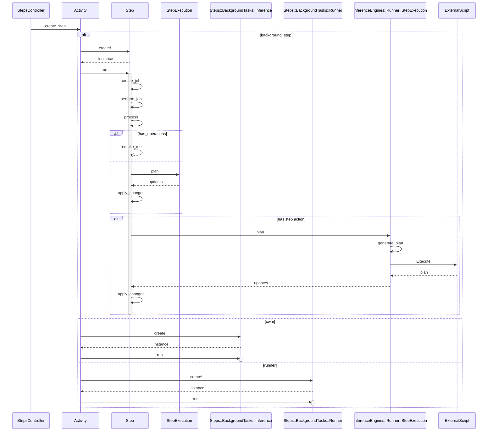

# Process diagram for step processing

This diagram is an attempt to map out the step process to aid performance
optimizations. It is _not_ and exhaustive map of all calls in the process.

## Sequence Diagram

